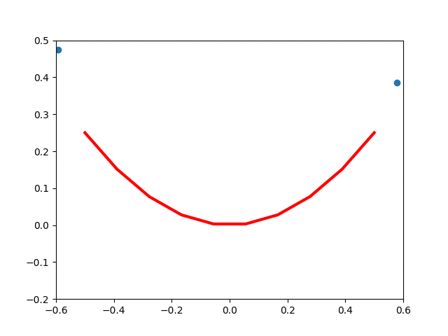

# Autodiff
Autodiff is a python framework for reverse mode automatic differentiation.

## Requirement installation

Installing requirements using the package manager [pip](https://pip.pypa.io/en/stable/).

```bash
pip install -r requirements.txt
```

## Usage

```python
from autodiff.tensor import Tensor

# simple tensor with gradient, prior to backward gradients are zero
t1 = Tensor(2., requires_gradient=True)
t1.gradient  # returns Tensor=0., requires_gradient=False

t2 = Tensor(10., requires_gradient=True)
t2.gradient  # returns Tensor=0., requires_gradient=False


# tensor product with backward pass to update gradients
t_prod = t1*t2
t_prod  # returns Tensor=20., requires_gradient=True
t_prod.backward()

t1.gradient  # returns Tensor=10.0, requires_gradient=False
t2.gradient  # returns Tensor=2.0, requires_gradient=False

```
## Examples
**xor.py:**


A quick example of a simple non-linear function.
```bash
$ python xor.py
Epoch: 200, Loss: 1.376881754114702
Epoch: 400, Loss: 9.914077531156499e-05
Epoch: 600, Loss: 9.016186371242976e-09
Epoch: 800, Loss: 9.781083589476058e-13
Epoch: 1000, Loss: 3.464732251500225e-10

==================================================
xor truthtable:
[[1 0]
 [0 1]
 [0 1]
 [1 0]]

==================================================
Network prediction xor truthtable:
[[ 1.00000237e+00 -2.37539321e-06]
 [ 7.92300488e-06  9.99992083e-01]
 [ 7.93465799e-06  9.99992071e-01]
 [ 1.00000738e+00 -7.38902982e-06]]
```

**1d-gan.py:**


Inspired by [Jason Brownlee's awesome 1D gan](https://machinelearningmastery.com/how-to-develop-a-generative-adversarial-network-for-a-1-dimensional-function-from-scratch-in-keras/)
example I inspired to implement it in autodiff. A gif of the generator
learning can be seen underneath (disclaimer: this could be better/smoother
had I used a different loss function like [Binary Cross Entropy](https://en.wikipedia.org/wiki/Cross_entropy)
instead of [squared error](https://en.wikipedia.org/wiki/Errors_and_residuals)).


more to come..


## Milestones
**Tensor operations:**
- [x] sum
- [x] add
- [x] multiplication
- [x] negation
- [x] subtraction
- [x] transpose
- [x] slicing
- [x] division
- [x] power
- [x] natural logarithm
- [x] exp

**Network:**
- [x] Parameter
- [x] Module
- [x] Sequential
- [x] Linear Layer

**Activation functions:**
- [x] ReLU
- [x] Tanh

**Loss functions:**
- [ ] Binary Cross Entropy
- [x] Cross Entropy

more to come..
## Contributing
Pull requests are welcome. For major changes, please open an issue first to discuss what you would like to change.

Please make sure to update tests as appropriate.

## Acknowledgment
I was inspired to try to write my own deep learning framework from (numpy) scratch. In part from working with the awesome Python library [PyTorch](https://pytorch.org/) and wanting to understand that better. As well as from the being inspired by [Joel Grus](https://joelgrus.com/), his talks
and YouTube videos on the matter.

Additionally, the book `Mathematics for Machine Learning` proved to be a very
helpful tool and an enjoyable read.

## License
[MIT](https://choosealicense.com/licenses/mit/)